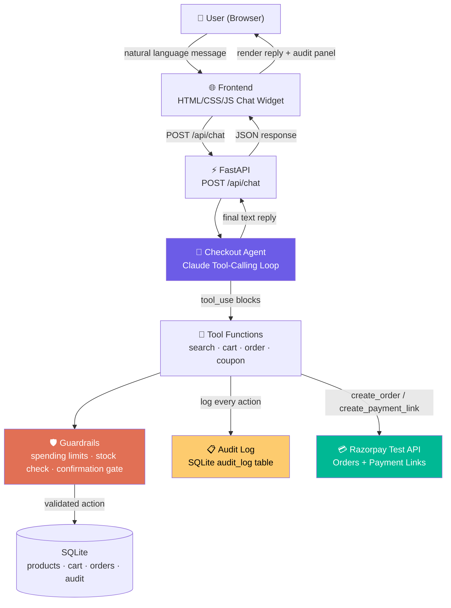

# MerchantAgent — Conversational Checkout Agent

> **Razorpay AI Buildathon submission** — Track 01: AI Growth & Agentic Commerce

A conversational checkout agent that lets customers browse products, build a cart, apply coupons, and complete purchases through Razorpay's test-mode APIs — all via natural language chat. Every action is logged, guarded, and auditable.

---

## Live Demo Flow

```
User: "Show me wireless earbuds"
Agent: [search_catalog] → shows 2 products with prices

User: "Add the Pro one to my cart"
Agent: [add_to_cart] → "Added 1x Wireless Earbuds Pro (₹999) to your cart."

User: "Do you have a coupon for 10% off?"
Agent: [apply_coupon SAVE10] → "Coupon applied — 10% discount!"

User: "Checkout"
Agent: [create_razorpay_order] → "Your order is ₹899. Please confirm."
User: "Yes, confirm"
Agent: [confirm_order] → "Order created! Here's your payment link: https://rzp.io/..."
```

Right panel shows every tool call with explanation, arguments, result, and guardrail status.

---

## Architecture



### Audit Trail Path

Every tool call flows through the audit logger **before** the result is returned to Claude:

```
Claude → tool_use block → Guardrail check → Execute tool → Audit entry (logged) → tool_result → Claude
```

The audit panel in the UI renders every entry with:
- **Action name** (e.g. `create_razorpay_order`)
- **Explanation** (e.g. "Created Razorpay order ord_xxx for ₹899")
- **Guardrail status** (e.g. "Blocked: exceeds single order limit")
- **Timestamp**

---

## Setup

### 1. Clone and install

```bash
git clone <your-repo-url>
cd merchant-agent
python -m venv .venv
source .venv/bin/activate  # Windows: .venv\Scripts\activate
pip install -r requirements.txt
```

### 2. Configure API keys

```bash
cp .env.example .env
```

Edit `.env` with your keys:

```env
OPENROUTER_API_KEY=sk-or-...           # Get from openrouter.ai/keys
OPENROUTER_MODEL=anthropic/claude-sonnet-4-20250514  # Any model from openrouter.ai/models
RAZORPAY_KEY_ID=rzp_test_...           # Get from dashboard.razorpay.com → Settings → API Keys
RAZORPAY_KEY_SECRET=...                # Same page, revealed on creation
```

> **Note:** OpenRouter gives you access to Claude, Gemini, Llama, Mistral, and dozens more through a single API key. You can swap models instantly via `OPENROUTER_MODEL` in `.env`.

> **Note:** Razorpay test-mode keys don't move real money. Use test card `4111 1111 1111 1111` with any future expiry and CVV `123` to simulate successful payments.

### 3. Run

```bash
python -m backend.main
```

Open **http://127.0.0.1:8000** in your browser.

---

## Project Structure

```
merchant-agent/
├── backend/
│   ├── main.py              # FastAPI app, endpoints, lifespan
│   ├── agent.py             # Claude tool-calling orchestration
│   ├── tools.py             # Validated tool functions (LLM never fabricates state)
│   ├── models.py            # SQLAlchemy ORM + Pydantic schemas
│   ├── audit.py             # Audit trail logging + query
│   ├── razorpay_client.py   # Razorpay SDK wrapper with retry/fallback
│   └── seed.py              # Demo products and coupons
├── frontend/
│   └── index.html           # Chat widget + audit panel
├── .env.example
├── requirements.txt
└── README.md
```

---

## Guardrails

| Guardrail | Limit | Enforced By |
|-----------|-------|-------------|
| Max single order | ₹5,000 | `tools.py` — rejects orders above limit |
| Max session spending | ₹20,000 | `tools.py` — blocks cart additions that would exceed |
| Max quantity per item | 5 | `tools.py` — validates before adding |
| Max coupon discount | 25% | `tools.py` — rejects coupons above cap |
| Order confirmation gate | ≥ ₹500 | `tools.py` — returns confirmation prompt, agent asks user |
| Empty cart checkout | N/A | `tools.py` — blocks with helpful message |

**The LLM never generates amounts or order IDs.** All money values come from the product catalog (SQLite), and order IDs come from Razorpay's API response.

---

## Audit Trail

Every tool call is logged to `audit_log` with:

- **`action`** — tool name (e.g. `add_to_cart`)
- **`arguments`** — exact JSON args sent by Claude
- **`result`** — exact JSON result returned
- **`status`** — `success` | `blocked` | `failed`
- **`guardrail`** — which guardrail fired, if any
- **`explanation`** — human-readable sentence explaining what happened
- **`created_at`** — UTC timestamp

View via:
- **UI:** Right panel shows entries in real-time
- **API:** `GET /api/audit/{session_id}` returns the full trail
- **Database:** Query `audit_log` table directly

---

## Graceful Failure Handling

| Scenario | Behavior |
|----------|----------|
| Razorpay order creation fails | Retry once → fallback to payment link |
| Razorpay API down | Retry once → show "try again later" message |
| Claude API timeout | Return friendly error, suggest browsing products directly |
| Cart empty at checkout | Block with "add items first" message |
| Product out of stock | Block with "only X left" message |
| Invalid coupon | Block with "coupon invalid/expired" message |

**Simulated failure for demo:** Use Razorpay's test card `4000 0000 0000 0002` to simulate a declined payment. The webhook handler will mark the order as failed, and the audit trail shows the failure.

---

## Assumptions to Verify

> **Flagged for your review before submission:**

1. **Razorpay Python SDK runs synchronously** — I wrap SDK calls with `asyncio.to_thread()` to avoid blocking the FastAPI event loop. Verify the SDK works correctly in this mode with your test keys.

2. **Webhook signature verification** — If `RAZORPAY_WEBHOOK_SECRET` is not set, signature verification is skipped (fine for local demo). Set it in production.

3. **Payment Link vs Checkout.js** — I use Payment Links (simpler for demo — gives a URL to share). If you prefer embedded Checkout.js, the `create_razorpay_order` tool already creates the Razorpay order — you'd just need to add a frontend checkout flow using the Razorpay checkout.js script with the order ID.

4. **LLM model** — Default is `anthropic/claude-sonnet-4-20250514` via OpenRouter. Change via `OPENROUTER_MODEL` in `.env` — any model on openrouter.ai works (Gemini, Llama, Mistral, etc.).

5. **SQLite thread safety** — `check_same_thread=False` is set. Fine for demo; in production use a connection pool.

---

## Tech Stack

| Component | Technology |
|-----------|-----------|
| Backend | Python 3.11+, FastAPI |
| LLM | OpenRouter (OpenAI-compatible API) — Claude, Gemini, Llama, etc. |
| Payments | Razorpay Python SDK (test mode) |
| Database | SQLite + SQLAlchemy |
| Frontend | Vanilla HTML/CSS/JS |
| Audit | SQLite `audit_log` table |

---

## API Endpoints

| Method | Path | Description |
|--------|------|-------------|
| `POST` | `/api/chat` | Send message → agent reply + tool actions + cart |
| `GET` | `/api/products` | List all products (optional `?category=`) |
| `GET` | `/api/audit/{session_id}` | Audit trail for a session |
| `GET` | `/api/audit` | All audit entries |
| `GET` | `/api/orders/{session_id}` | Orders for a session |
| `POST` | `/webhook/razorpay` | Razorpay webhook receiver |
| `GET` | `/health` | Liveness check |
| `GET` | `/` | Frontend UI |

---

## Demo Script (for 5-minute pitch)

1. **0:00-0:30** — "This is a conversational checkout agent. Customers chat naturally to browse, add to cart, and pay via Razorpay test mode."

2. **0:30-1:30** — Type "show me wireless earbuds" → agent calls `search_catalog` → results appear. Point to the audit panel: "Every action is logged with explanation."

3. **1:30-2:30** — "Add the Pro one" → agent calls `add_to_cart` → cart updates. "Also add the Bluetooth speaker" → cross-sell. Show audit trail growing.

4. **2:30-3:30** — "I have a coupon SAVE10" → agent calls `apply_coupon` → discount applied. Show guardrail in audit: "Discount validated against our 25% cap."

5. **3:30-4:30** — "Checkout" → agent creates Razorpay order, shows confirmation. "Confirm" → order created. "Generate payment link" → link appears.

6. **4:30-5:00** — Show the full audit trail. "Every money action — search, add, coupon, order — is explainable, bounded by guardrails, and gated by confirmation. This is production-grade agentic commerce."

---

## License

MIT
