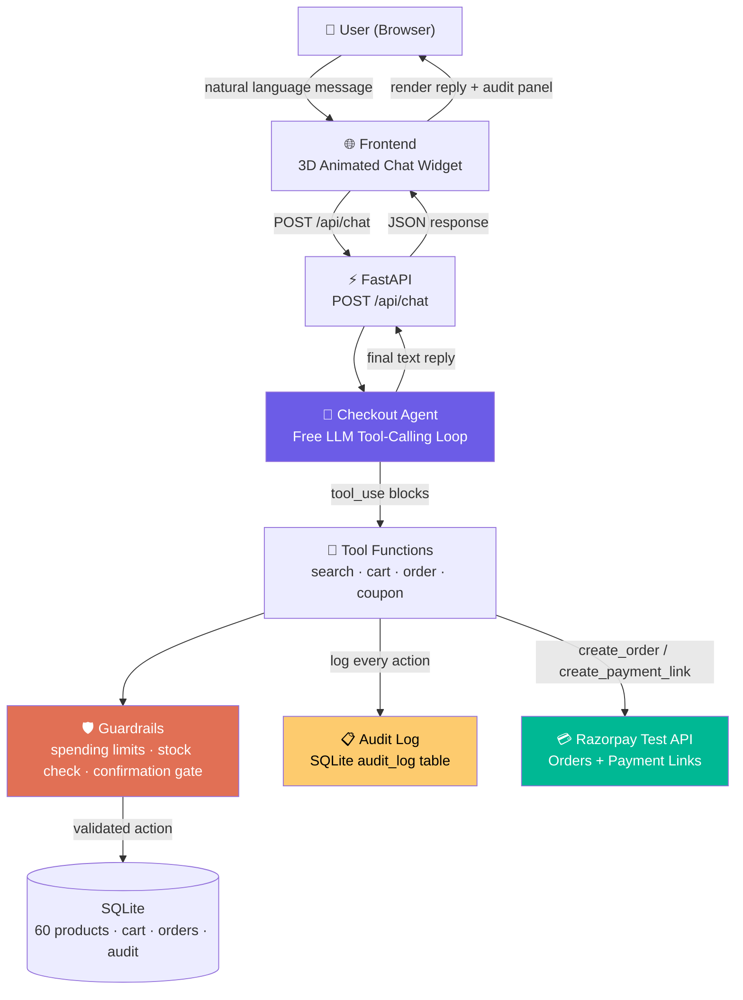

# MerchantAgent — Conversational Checkout Agent

> **Razorpay AI Buildathon submission** — Track 01: AI Growth & Agentic Commerce

A conversational checkout agent that lets customers browse products, build a cart, apply coupons, and complete purchases through Razorpay's test-mode APIs — all via natural language chat. Every action is logged, guarded, and auditable. Runs on **free OpenRouter models** with zero API cost.

---

## Live Demo Flow

```
User: "Show me wireless earbuds"
Agent: [search_catalog] → shows products with prices

User: "Add the Pro one to my cart"
Agent: [add_to_cart] → "Added 1x Wireless Earbuds Pro (₹999) to your cart."

User: "Do you have a coupon for 10% off?"
Agent: [apply_coupon SAVE10] → "Coupon applied — 10% discount!"

User: "Checkout"
Agent: [create_razorpay_order] → "Your order is ₹899. Please confirm."
User: "Yes, confirm"
Agent: [confirm_order] → "Order created! Here's your payment link: https://rzp.io/..."
```

Right panel shows every tool call with explanation, arguments, result, and guardrail status.

---

## Architecture



### Free Model Fallback Chain

The agent tries free OpenRouter models in order until one succeeds — zero API cost:

| Priority | Model | Active Params | Context |
|----------|-------|---------------|---------|
| 1st | `thinkingmachines/inkling:free` | 41B | 1M tokens |
| 2nd | `dots-studio/dots-3-note-preview:free` | 16B | 512K tokens |
| 3rd | `nvidia/nemotron-3.5-lightning:free` | 3B | 1M tokens |

Set `OPENROUTER_MODEL=` (blank) in `.env` to use the chain, or set a specific model to override.

### Audit Trail Path

Every tool call flows through the audit logger **before** the result is returned to the LLM:

```
LLM → tool_use block → Guardrail check → Execute tool → Audit entry (logged) → tool_result → LLM
```

---

## Setup

### 1. Clone and install

```bash
git clone <your-repo-url>
cd merchant-agent
python -m venv .venv
source .venv/bin/activate  # Windows: .venv\Scripts\activate
pip install -r requirements.txt
```

### 2. Configure API keys

```bash
cp .env.example .env
```

Edit `.env`:

```env
# OpenRouter — free models, no cost
OPENROUTER_API_KEY=sk-or-...              # Get from openrouter.ai/keys
OPENROUTER_MODEL=                          # Leave blank for free fallback chain

# Razorpay test mode
RAZORPAY_KEY_ID=rzp_test_...              # Get from dashboard.razorpay.com → Settings → API Keys
RAZORPAY_KEY_SECRET=...                   # Same page, revealed on creation
```

> **Razorpay test-mode keys don't move real money.** Use test card `4111 1111 1111 1111` with any future expiry and CVV `123` to simulate successful payments.

### 3. Run

```bash
python -m backend.main
```

Open **http://127.0.0.1:8000** in your browser.

---

## Project Structure

```
merchant-agent/
├── backend/
│   ├── main.py              # FastAPI app, endpoints, lifespan
│   ├── agent.py             # Free LLM tool-calling orchestration + fallback chain
│   ├── tools.py             # Validated tool functions (LLM never fabricates state)
│   ├── models.py            # SQLAlchemy ORM + Pydantic schemas
│   ├── audit.py             # Audit trail logging + query
│   ├── razorpay_client.py   # Razorpay SDK wrapper with retry/fallback
│   └── seed.py              # 60 demo products + 5 coupons across 10 categories
├── frontend/
│   └── index.html           # 3D animated chat widget (Three.js) + audit panel
├── .env.example
├── requirements.txt
└── README.md
```

---

## Product Catalog

**60 products** across **10 categories**:

| Category | Products | Price Range |
|----------|----------|-------------|
| Electronics | 8 | ₹299 – ₹1,999 |
| Accessories | 7 | ₹349 – ₹1,990 |
| Home & Lifestyle | 7 | ₹1,099 – ₹4,999 |
| Fitness | 6 | ₹399 – ₹3,499 |
| Stationery | 5 | ₹299 – ₹1,190 |
| Clothing & Fashion | 6 | ₹499 – ₹2,499 |
| Kitchen | 5 | ₹399 – ₹3,499 |
| Personal Care | 5 | ₹699 – ₹1,799 |
| Books & Media | 5 | ₹349 – ₹899 |
| Garden & Outdoor | 3 | ₹799 – ₹1,999 |

**5 coupons:** `SAVE10` (10%), `FLAT20` (20%), `WELCOME15` (15%), `MEGA25` (25%), `FIRST50` (50%)

---

## Guardrails

| Guardrail | Limit | Enforced By |
|-----------|-------|-------------|
| Max single order | ₹5,000 | `tools.py` — rejects orders above limit |
| Max session spending | ₹20,000 | `tools.py` — blocks cart additions that would exceed |
| Max quantity per item | 5 | `tools.py` — validates before adding |
| Max coupon discount | 25% | `tools.py` — rejects coupons above cap |
| Order confirmation gate | ≥ ₹500 | `tools.py` — returns confirmation prompt, agent asks user |
| Empty cart checkout | N/A | `tools.py` — blocks with helpful message |

**The LLM never generates amounts or order IDs.** All money values come from the product catalog (SQLite), and order IDs come from Razorpay's API response.

---

## Audit Trail

Every tool call is logged to `audit_log` with:

- **`action`** — tool name (e.g. `add_to_cart`)
- **`arguments`** — exact JSON args sent by the LLM
- **`result`** — exact JSON result returned
- **`status`** — `success` | `blocked` | `failed`
- **`guardrail`** — which guardrail fired, if any
- **`explanation`** — human-readable sentence explaining what happened
- **`created_at`** — UTC timestamp

View via:
- **UI:** Right panel shows entries in real-time
- **API:** `GET /api/audit/{session_id}` returns the full trail
- **Database:** Query `audit_log` table directly

---

## Tech Stack

| Component | Technology |
|-----------|-----------|
| Backend | Python 3.11+, FastAPI |
| LLM | OpenRouter free models (Inkling, Dots3, Nemotron) via OpenAI SDK |
| Payments | Razorpay Python SDK (test mode) |
| Database | SQLite + SQLAlchemy |
| Frontend | Vanilla HTML/CSS/JS + Three.js (3D animated Razorpay logo) |
| Audit | SQLite `audit_log` table |

---

## API Endpoints

| Method | Path | Description |
|--------|------|-------------|
| `POST` | `/api/chat` | Send message → agent reply + tool actions + cart |
| `GET` | `/api/products` | List all products (optional `?category=`) |
| `GET` | `/api/audit/{session_id}` | Audit trail for a session |
| `GET` | `/api/audit` | All audit entries |
| `GET` | `/api/orders/{session_id}` | Orders for a session |
| `POST` | `/webhook/razorpay` | Razorpay webhook receiver |
| `GET` | `/health` | Liveness check |
| `GET` | `/` | Frontend UI |

---

## Deployment

### Railway (recommended for demos)

1. Push code to GitHub
2. Connect repo to Railway at [railway.app](https://railway.app)
3. Set environment variables in Railway dashboard (Variables tab):
   ```
   OPENROUTER_API_KEY=sk-or-...
   RAZORPAY_KEY_ID=rzp_test_...
   RAZORPAY_KEY_SECRET=...
   ```
4. Railway auto-detects Python and deploys

### Local

```bash
python -m backend.main
# Access at http://127.0.0.1:8000
```

---

## Demo Script (5-minute pitch)

1. **0:00-0:30** — "This is a conversational checkout agent running on free LLM models. Zero API cost, fully auditable."

2. **0:30-1:30** — Type "show me wireless earbuds" → agent calls `search_catalog` → results appear. Point to the 3D animated UI and audit panel.

3. **1:30-2:30** — "Add the Pro one" → cart updates. "Also add the Bluetooth speaker" → cross-sell. Show 60-product catalog across 10 categories.

4. **2:30-3:30** — "I have a coupon SAVE10" → discount applied. Show guardrail validation in audit trail.

5. **3:30-4:30** — "Checkout" → Razorpay order created, confirmation flow, payment link generated.

6. **4:30-5:00** — "Every action is logged, guarded by spending limits, and uses only free models. Zero cost, production-grade agentic commerce."

---

## License

MIT
